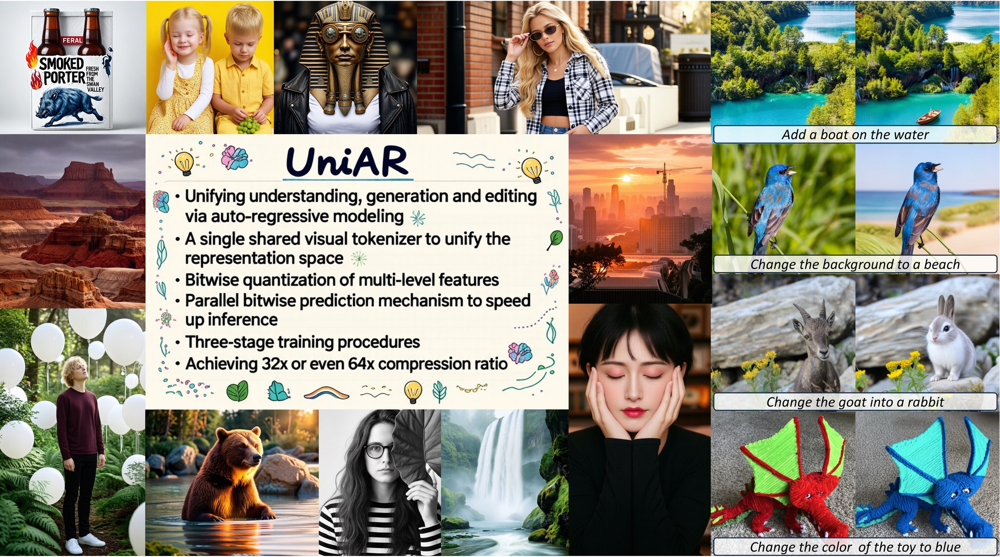

<div align="center">

<!-- <h1>UniAR</h1> -->
<h2>UniAR: Unified Multimodal Autoregressive Modeling with Shared Context</h2>
<h3><i>--Visual Tokenizer is Key to Unification</i></h3>

[Wujian Peng](https://wjpoom.github.io/)<sup>1,2,\*,#</sup>,
[Lingchen Meng](https://scholar.google.com/citations?user=pUl9H8gAAAAJ&hl=en)<sup>3,\*,‡</sup>,
Yuxuan Cai<sup>3</sup>,
Xianwei Zhuang<sup>3</sup>,
Yuhuan Yang<sup>3</sup>,
Rongyao Fang<sup>3</sup>,
<br>
Chenfei Wu<sup>3</sup>,
Junyang Lin<sup>3</sup>,
[Zuxuan Wu](https://zxwu.azurewebsites.net/)<sup>1,2,†</sup>,
[Shuai Bai](https://scholar.google.com/citations?user=ylhI1JsAAAAJ&hl=zh-CN)<sup>3,†</sup>

<sup>1</sup>Fudan University &nbsp;
<sup>2</sup>Shanghai Innovation Institute &nbsp;
<sup>3</sup>Qwen Team, Alibaba Inc.

<sup>*</sup>Equal Contributions &nbsp;
<sup>#</sup>Work done during internship at Qwen Team, Alibaba Inc. &nbsp;
<sup>‡</sup>Project Lead &nbsp;
<sup>†</sup>Corresponding Authors

[](https://arxiv.org/abs/2606.18249)
[](https://sharelab-sii.github.io/uniar-web)
[](https://huggingface.co/collections/ShareLab-SII/uniar)
</div>

<p align="center">
  
</p>

## Introduction

**UniAR** is a unified autoregressive multimodal model that handles **image understanding**, **image generation**, and **image editing** in a single Transformer. Unlike prior unified models that rely on two separate visual tokenizers (splitting the representation space), UniAR uses a **single discrete visual tokenizer** as the key bridge between understanding and generation, enabling a **shared context** in which the model can directly interpret its own generated visual tokens without additional re-encoding.

Key design choices:
- **Multi-level BSQ tokenizer** — fuses shallow (low-level detail) and deep (high-level semantic) visual features via lookup-free Binary Spherical Quantization, scaling the effective vocabulary to 2<sup>64</sup> codes with minimal overhead.
- **Parallel bitwise prediction** — jointly predicts spatially grouped, multi-level visual codes per AR step, achieving a **32x visual compression ratio** (a 1024x1024 image needs only 256 AR tokens).
- **DiT-based visual decoder** — an SD3-medium transformer with semantic visual feature injection that reconstructs high-fidelity images from discrete visual tokens, with resolution upsampling support.


## News

- **[2026/06]** Code and model weights released.
- **[2026/05]** UniAR is accepted by ICML 2026 🎉 !

## TODO

- [ ] Release visual decoder training code.

## Getting Started

### Installation

```bash
conda create -n uniar python=3.12 -y
conda activate uniar

git clone https://github.com/ShareLab-SII/UniAR.git
cd UniAR
pip install -e .            # inference dependencies
pip install -e ".[train]"   # additional training dependencies (deepspeed, datasets, etc.)
pip install flash-attn --no-build-isolation  # highly recommended for faster attention
```

Requirements: Python 3.12, CUDA 12.1+, GPU with >= 24 GB VRAM for inference.

### Checkpoints

Download the UniAR checkpoint (contains AR model + visual decoder components):

| Component | Role |
|-----------|------|
| `ar_model` | Unified autoregressive model |
| `bsq_encoder` | BSQ quantized image tokenizer |
| `sd3_transformer` | SD3 transformer with visual feature injection |
| `sd3_pipeline` | SD3 pipeline (VAE + text encoders) |

```bash
huggingface-cli download https://huggingface.co/ShareLab-SII/UniAR-RL --local-dir checkpoints/UniAR-RL
huggingface-cli download https://huggingface.co/ShareLab-SII/UniAR-SFT --local-dir checkpoints/UniAR-SFT
```

## Inference

### Image Understanding

```bash
conda activate uniar
python inference/chat.py \
    --model_path checkpoints/UniAR-RL \
    --image https://qianwen-res.oss-cn-beijing.aliyuncs.com/Qwen-VL/assets/demo.jpeg \
    --prompt "Describe this image in detail."
```

### Image Generation

```bash
conda activate uniar
python inference/generate.py \
    --model_path checkpoints/UniAR-RL \
    --prompt "A cute anime girl." \
    --output_path output.png
```

See [docs/inference.md](docs/inference.md) for the full parameter reference and advanced usage.


## Evaluation

We provide a unified batch inference script ([`inference/generate_batch.py`](inference/generate_batch.py)) that supports **multi-node, multi-GPU** distributed generation via `accelerate`. All outputs are organized in a standard directory structure:

```
<output_path>/<run_name>/
├── 00000/
│   ├── metadata.json
│   └── samples/
│       ├── 0000.png
│       ├── 0001.png
│       └── ...
├── 00001/
│   └── ...
```

To evaluate on specific benchmarks, we provide conversion scripts under [`eval/convert_structure/`](eval/convert_structure/) that transform our unified output layout into each benchmark's expected format.

See [docs/evaluation.md](docs/evaluation.md) for the full evaluation guide.

## Training

### Reinforcement Learning

UniAR uses GRPO with a multi-reward stack for reinforcement learning on image generation. The training system runs across multiple nodes: decode servers (BSQ visual codes → images), reward servers (scoring), and training nodes (AR rollout + GRPO updates).

See [docs/training_rl.md](docs/training_rl.md) for the complete setup guide.

## Acknowledgements

UniAR builds upon several excellent open-source projects:

- [Qwen3-VL](https://github.com/QwenLM/Qwen3-VL)
- [X-Omni](https://github.com/X-Omni-Team/X-Omni)
- [Infinity](https://github.com/FoundationVision/Infinity)
- [Stable Diffusion 3](https://huggingface.co/stabilityai/stable-diffusion-3.5-medium)
- [TRL](https://github.com/huggingface/trl)

We also thank the benchmark authors for their evaluation tools:
[GenEval](https://github.com/djghosh13/geneval),
[OneIG-Bench](https://github.com/OneIG-Bench/OneIG-Benchmark),
[LongText-Bench](https://github.com/X-Omni-Team/X-Omni),
[ImgEdit](https://github.com/PKU-YuanGroup/ImgEdit).

## Citation

If you find UniAR useful in your research, please consider citing:

```bibtex
@inproceedings{peng2026uniar,
  title={Unified Multimodal Autoregressive Modeling with Shared Context --- Visual Tokenizer is Key to Unification},
  author={Peng, Wujian and Meng, Lingchen and Cai, Yuxuan and Zhuang, Xianwei and Yang, Yuhuan and Fang, Rongyao and Wu, Chenfei and Lin, Junyang and Wu, Zuxuan and Bai, Shuai},
  booktitle={ICML},
  year={2026}
}
```
